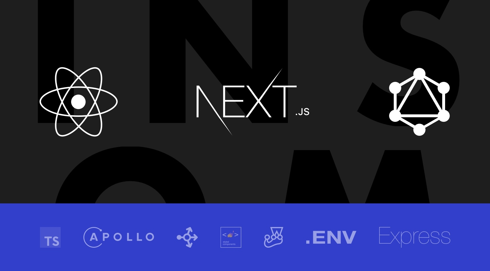

 

Performance oriented Next.js application boilerplate with GraphQL, Typescript, Express.js and Styled Components.

 

  Created by <a  target="_blank" href="https://www.insomniacdesign.com/">Insomniac Design</a>

## About

Next.js gives you the best developer experience with all the features you need
for production: hybrid static & server rendering, TypeScript support, smart
bundling, route pre-fetching, and more. No config needed.

 

## Features

Insomniac Design next-boilerplate project provides a lot of features out of the
box. Here's an overview of the included components and tools.

- **Next.js** - Minimalistic framework for server-rendered React applications.
- **Typescript** - Superset of JavaScript which primarily provides optional
  static typing, classes and interfaces.
- **GraphQL** - GraphQL is a query language for APIs and a runtime for
  fulfilling those queries with your existing data.
- **Express.js**- A minimal and flexible Node.js web application framework that
  handles server-side rendering and integrates with Next.js.
- **Built-in Project CLI**- Create pages, components, actions, reducers with one
  command by using built-in cli.
- **StyledComponents** - Visual primitives for the component age. Use the best
  bits of ES6 and CSS to style your apps without stress
- **MaterialUI** - React components for faster and easier web development.  
- **Babel** - The compiler for next generation JavaScript.
- **ESLint** - The pluggable linting utility.
- **Bundler Analyzer** - Visualize the size of webpack output files with an
  interactive zoomable treemap.
- **Storybook** - An open source tool for developing UI components in isolation
  for React.

## License

Licensed under the MIT License, Copyright © 2020-present Insomniac Design
# graphql-gen
